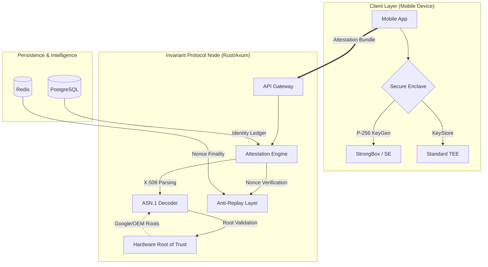
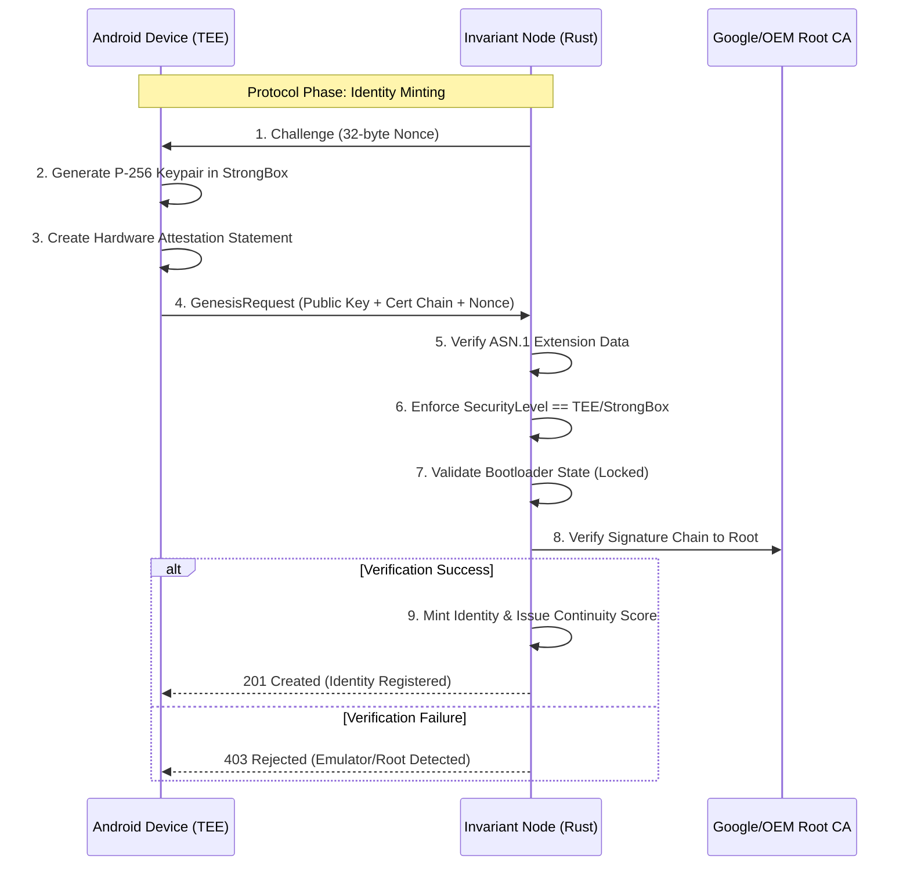
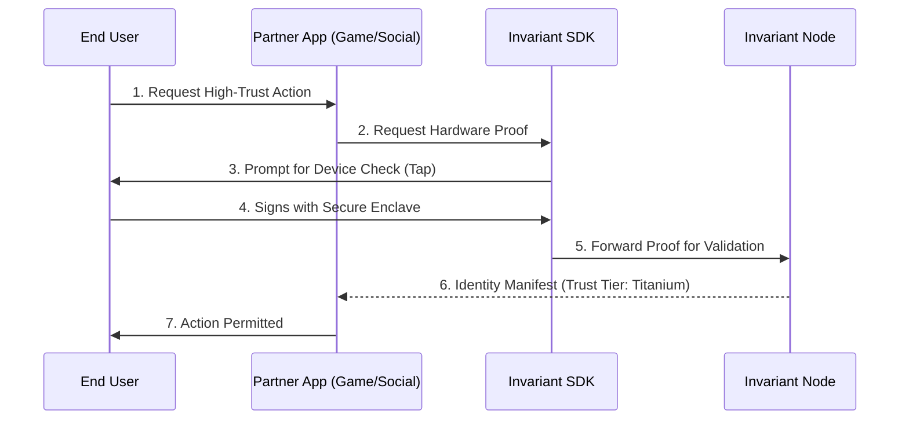

# Invariant Protocol

### Hardware-Rooted Identity Infrastructure

---

## 📖 Overview

Invariant is a protocol for establishing **high-fidelity, hardware-rooted Sybil resistance**. It leverages Trusted Execution Environments (TEEs) and Android KeyStore attestation to bind digital identifiers to physical silicon.

By enforcing cryptographic proofs of device provenance at the hardware level, Invariant raises the marginal cost of account forgery from the cost of software (near zero) to the cost of physical hardware acquisition.

### System Guarantees

Invariant enforces the following strict system properties:

1. **Non-Exportability:** Private keys are generated inside the Secure Element (SE) or TEE and are marked `sensitive`. They never leave the secure hardware boundary.
2. **OS Integrity:** Attestation is only valid if the device bootloader state is `LOCKED` and the `VerifiedBootState` is `VERIFIED`.
3. **Unlinkability:** Identities are scoped to the partner application. Invariant does not maintain a global graph of user activity across disparate services.
4. **Fail-Closed:** Any deviation in the X.509 certificate chain, root of trust signature, or nonce mismatch results in immediate rejection.

---

## 🏗 System Architecture

The protocol operates as a decentralized verification layer composed of three primary subsystems: client-side hardware orchestration, the attestation engine, and the persistence layer.



---

## 🔐 Remote Attestation (Genesis)

The "Genesis" event is the initial binding of a device to the network. It utilizes the Android KeyStore Attestation extension to prove device authenticity without relying on software-level checks which can be spoofed by emulators or dynamic instrumentation frameworks (e.g., Frida).



---

## ⚔️ Threat Model & Security Boundaries

Invariant addresses **Digital Sybil Attacks** via hardware constraints. The following table defines the scope of protection and acknowledged limitations.

| Attack Vector | Status | Enforcement Mechanism |
| --- | --- | --- |
| **Emulator Farms** | 🛡️ **Blocked** | Absence of valid OEM Root of Trust signatures in the certificate chain. |
| **Rooted/Compromised OS** | 🛡️ **Blocked** | Verification of `VerifiedBootState` and `deviceLocked` ASN.1 tags. |
| **Replay Attacks** | 🛡️ **Blocked** | Server-issued nonces are cryptographically bound to the TEE signature. |
| **Device Resale** | ⚠️ **Mitigated** | **Continuity Score** decay forces active possession; reputation is not permanent. |
| **Physical Coercion/Theft** | ❌ **Out of Scope** | The protocol verifies the device, not the operator. Device-level auth (PIN/Bio) is relied upon. |

---

## ⚖️ Economic & Security Rationale

Identity systems based on probabilistic signals (IP reputation, behavioral biometrics) suffer from false positives and scalability limits. Invariant shifts the verification model to deterministic hardware constraints.

### 1. Hardware-Backed Integrity

Verification occurs at the silicon layer. By validating the certificate chain against the OEM Root of Trust (e.g., Google, Samsung), the protocol ensures the request originates from genuine hardware running a signed, unmodified operating system.

### 2. Trust Decay Model

Identity is treated as a temporal state rather than a static flag.

* **Continuity Score:** A dynamic metric maintained by periodic, encrypted heartbeats.
* **Tiered Security:**
* **Titanium:** Backed by a dedicated Secure Element (StrongBox/Titan M).
* **Steel:** Backed by the primary TEE (TrustZone).


### 3. Privacy Preservation

The protocol validates **existence** (is this a unique human?) rather than **identity** (who is this?).

* **Zero PII:** No demographic data is ingested.
* **Isolation:** Identifiers are pairwise unique to the partner application to prevent cross-service correlation.

---

## 🚀 Integration (B2B SDK)

The Invariant SDK exposes a stateless verification interface for partner applications.

### Integration Flow



### Implementation Example

```rust
// Example: Verifying an Invariant Identity via Rust SDK
let is_valid = invariant_sdk::verify(
    &user_identity_id,
    &attestation_proof
).await?;

if is_valid.tier == "TITANIUM" {
    // Proceed with high-assurance logic
}

```

---

## 🛠 Development Status

* [x] **Core Engine:** Rust Attestation Engine & ASN.1 Parsers.
* [x] **Testnet:** Mobile Client & Node V1 (Active).
* [ ] **SDK:** Public B2B SDK Release (Beta).
* [ ] **Network:** Decentralized Validator Federation.

---

## 📄 License

Invariant Protocol is licensed under the **Business Source License 1.1 (BSL 1.1)**.

* **Evaluation:** Non-production use is permitted.
* **Production:** Use for >1,000 Monthly Active Users (MAU) requires a commercial license.
* **Change Date:** Converts to **Apache 2.0** on January 1, 2030.

[Download Release](https://invariantprotocol.com/pilot) | [Whitepaper](https://invariantprotocol.com/whitepaper) | [Source Code](https://www.google.com/search?q=https://github.com/KarmaYama/invariant-monorepo)

*Copyright © 2026 Invariant Protocol.*