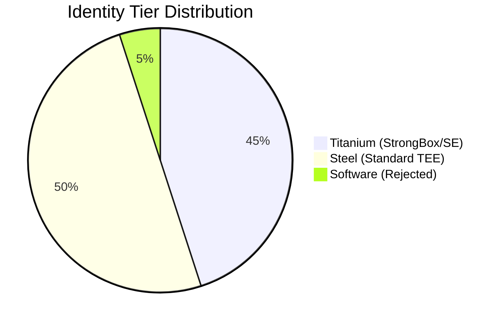

# Invariant Protocol

### The Hardware-Bound Identity Anchor for a Post-AI World

---

## 🏗 System Architecture

Invariant operates as a decentralized infrastructure layer. It bridges the gap between physical silicon and digital identity through high-fidelity hardware attestation.


---

## 🔐 The Genesis Protocol (Remote Attestation)

The "Genesis" event is a cryptographic handshake that proves a user is a unique human with a genuine, untampered device. This process is effectively "un-emulatable."


---

## ⚡ Why Invariant?

The digital world is currently facing an "Identity Inflation" crisis. Invariant solves this by shifting the cost of Sybil attacks from **software (cheap)** to **silicon (expensive)**.

### 1. Hardware-Backed Verification

Unlike traditional 2FA, Invariant verifies the integrity of the OS. If the bootloader is unlocked or the device is an emulator, the attestation fails at the cryptographic level.

### 2. Trust Decay & Persistence

Trust isn't static. Invariant uses a **Continuity Score** maintained by background heartbeats.

* **Titanium Tier:** Hardware-bound keys stored in a dedicated Secure Element.
* **Steel Tier:** Hardware-bound keys stored in the main TEE.

### 3. Privacy-First Identity

Invariant validates **existence**, not demographics. No iris scans, no passports—just the cryptographic proof that a unique device is in the hands of a human.

---

## 📊 Security Tiers



---

## 🚀 Developer Integration (B2B SDK)

Integrate Invariant into your application to eliminate bot traffic and Sybil attacks.

### Integration Flow


### Implementation Example

```rust
// Example: Verifying an Invariant Identity in your Backend
let is_valid = invariant_sdk::verify(
    &user_identity_id,
    &attestation_proof
).await?;

if is_valid.tier == "TITANIUM" {
    // Grant high-trust access (e.g., Ranked Matchmaking, Airdrop)
}

```

---

## 🗺️ Roadmap

* [x] **Phase 1:** Core Rust Engine & Attestation Logic.
* [ ] **Phase 2:** B2B SDK Product Hunt Launch (In Progress).
* [ ] **Phase 3:** Pilot Launch in High-Bot Environments.
* [ ] **Phase 4:** Decentralized Validation Network.

---

## 🛡️ License

Invariant Protocol is licensed under the **Business Source License 1.1 (BSL 1.1)**.

* Non-production use is permitted.
* Production use for more than 1,000 MAU requires a commercial license.
* Converts to **Apache 2.0** on January 1, 2030.

[Download Release](https://invariantprotocol.com/pilot) | [Whitepaper](https://invariantprotocol.com/whitepaper) | [Source](https://www.google.com/search?q=https://github.com/KarmaYama/invariant-monorepo)

*Copyright © 2026 Invariant Protocol. Built with Rust and Iron.*

---