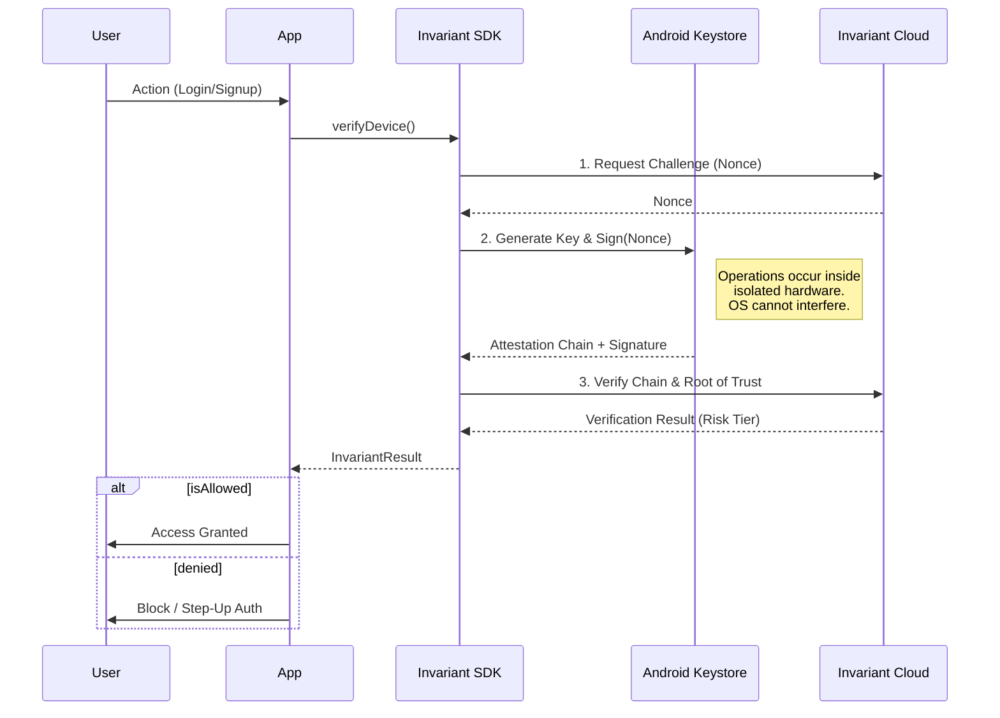

# Invariant SDK

**The Hardware-Bound Identity Layer for Flutter.**

[](https://pub.dev/packages/invariant_sdk)
[](LICENSE.md)
[](https://developer.android.com)

Invariant provides cryptographic proof that a user is operating a physical, uncompromised device. It eliminates emulators, server farms, and scripted bots by validating the **Trusted Execution Environment (TEE)** at the silicon layer.

Unlike behavioral analytics or CAPTCHAs, Invariant is deterministic. It does not collect PII, biometrics, or behavioral data.

---

## 🏗 Architecture

The SDK orchestrates a "Hardware Handshake" between your application, the device's Secure Element, and the Invariant Verification Node.



---

## 🚀 Integration

### 1. Installation

Add the dependency to your `pubspec.yaml`:

```yaml
dependencies:
  invariant_sdk: ^1.0.4

```

### 2. Initialization

Initialize the SDK at the root of your application. We recommend starting in **Shadow Mode** to audit your traffic without affecting users.

```dart
import 'package:invariant_sdk/invariant_sdk.dart';

void main() {
  Invariant.initialize(
    apiKey: "YOUR_API_KEY",
    // start in shadow mode to log threats without blocking
    mode: InvariantMode.shadow, 
  );
  
  runApp(MyApp());
}

```

### 3. Verification

Call `verifyDevice()` at critical checkpoints (e.g., Registration, High-Value Transactions).

```dart
final result = await Invariant.verifyDevice();

if (result.isAllowed) {
  // Device is Verified (or System Failed-Open).
  // Safe to proceed.
  _completeLogin();
} else {
  // Threat Detected (Emulator, Rooted, or Policy Violation).
  // Block access.
  _showBlockScreen(result.riskTier);
}

```

---

## ⚙️ Configuration & Modes

Invariant supports two operational modes to fit your risk tolerance.

| Mode | Behavior | Use Case |
| --- | --- | --- |
| `InvariantMode.shadow` | **Audit Only.** Returns `allowed` for all devices, even emulators. Logs the true risk tier to the dashboard. | Initial integration, measuring fraud levels. |
| `InvariantMode.enforce` | **Active Blocking.** Returns `denied` for emulators or compromised devices. | Production security, anti-bot protection. |

---

## 🛡️ Risk Tiers

The `riskTier` field indicates the specific hardware classification of the device.

| Tier | Trust Level | Description |
| --- | --- | --- |
| **STRONGBOX** | 🟢 Highest | Key generated in a dedicated Secure Element (e.g., Titan M2, Knox Vault). |
| **TEE** | 🟢 High | Key generated in ARM TrustZone. Standard for modern Android devices. |
| **SOFTWARE** | 🔴 Critical | Key generated in software. Indicates OS tampering or lack of hardware support. |
| **EMULATOR** | 🔴 Critical | Virtualized environment detected. Immediate block recommended. |

---

## 🔌 Fail-Open Philosophy

The Invariant SDK is designed to be **Fail-Open**.

If the Invariant Network is unreachable, or if the device encounters a non-security hardware error, the SDK returns `InvariantStatus.allowedFailOpen`.

* **Rationale:** Your infrastructure availability should not depend on ours. Legitimate users should never be blocked due to network partitions.
* **Recommendation:** Treat `allowedFailOpen` as a success for user experience, but flag the session for backend review if necessary.

---

## ⚠️ Requirements & Compatibility

* **Android 9.0+** (API Level 28+)
* Device must have a **Secure Lock Screen** (PIN, Pattern, or Biometrics) configured. The TEE requires this to generate auth-bound keys.
* **iOS / Web:** The SDK returns `allowedFailOpen` on non-Android platforms to ensure cross-platform code compatibility, but verification is **not performed**.

---

## ⚖️ License

Invariant Protocol is licensed under the **Business Source License 1.1 (BSL)**.

* **Evaluation:** Non-production use is permitted.
* **Production:** Use for >1,000 Monthly Active Users (MAU) requires a commercial license.

[Read Full License](./LICENSE.md)

```

```