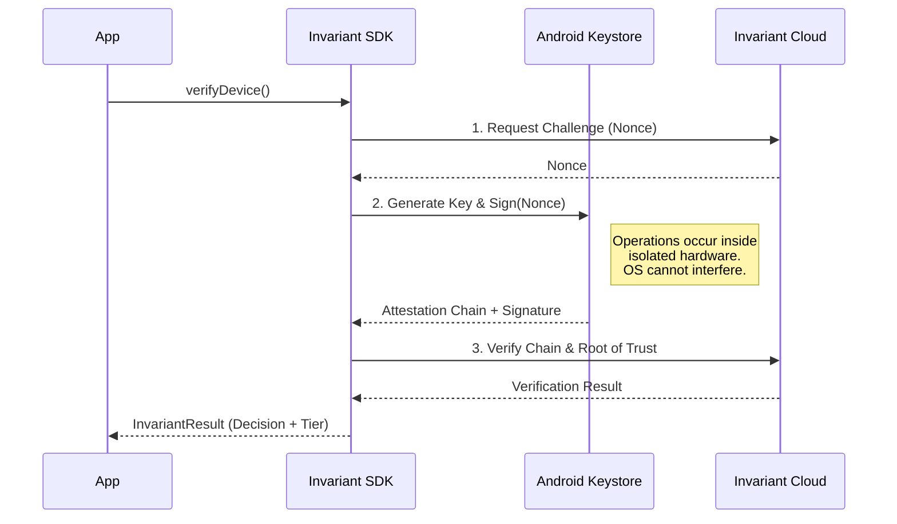

# Invariant SDK

**The Hardware-Bound Identity Layer for Flutter.**

[](https://pub.dev/packages/invariant_sdk)
[](https://developer.android.com)
[](LICENSE.md)

Invariant provides cryptographic proof that a user is operating a physical, uncompromised device. It eliminates emulators, server farms, and scripted bots by validating the **Trusted Execution Environment (TEE)** at the silicon layer.

Unlike behavioral analytics or CAPTCHAs, Invariant is deterministic. It does not collect PII, biometrics, or behavioral data.

---

## 🏗 Architecture

The SDK orchestrates a "Hardware Handshake" between your application, the device's Secure Element, and the Invariant Verification Node.



---

## 🚀 Quick Start

### 1. Installation

Add the dependency to your `pubspec.yaml`:

```yaml
dependencies:
  invariant_sdk: ^0.1.0

```

### 2. Initialization

Initialize the SDK at the root of your application (e.g., in `main.dart`).

```dart
import 'package:invariant_sdk/invariant_sdk.dart';

void main() {
  Invariant.initialize(
    apiKey: "pk_live_your_key_here", 
    // Use 'shadow' to log risks without blocking users
    // Use 'enforce' to block threats automatically
    mode: InvariantMode.shadow, 
  );
  
  runApp(MyApp());
}

```

### 3. Verify a Device

Call `verifyDevice()` at critical checkpoints (Sign Up, Login, or High-Value Transactions).

```dart
// 1. Run the hardware check
final result = await Invariant.verifyDevice();

// 2. Check the decision
if (result.isVerified) {
  // ✅ Success: The device is physical and trusted.
  print("Trusted Hardware: ${result.tier}"); // e.g., "TEE" or "STRONGBOX"
  proceedToApp();
} else {
  // ⛔ Risk Detected: Emulator, Rooted, or Hooking Framework.
  print("Verification Failed: ${result.reason}");
  
  if (result.decision == InvariantDecision.allowShadow) {
    // In Shadow Mode, we allow the user but log the incident
    logSecurityEvent(result.score, result.tier);
    proceedToApp();
  } else {
    // In Enforce Mode, we block the user
    showBlockScreen();
  }
}

```

---

## 📚 API Reference

### `InvariantResult`

The object returned by every verification attempt.

| Property | Type | Description |
| --- | --- | --- |
| **`decision`** | `enum` | The final enforcement action (`allow`, `allowShadow`, `deny`). |
| **`isVerified`** | `bool` | Helper getter. Returns `true` only if decision is `allow`. |
| **`tier`** | `String` | The hardware security classification (see below). |
| **`score`** | `double` | Risk score from 0.0 (Safe) to 100.0 (Malicious). |
| **`reason`** | `String?` | Human-readable reason for the decision (e.g., "Virtualization Detected"). |
| **`deviceModel`** | `String?` | The device model, verified by the hardware signature if available. |

### Trust Tiers (`result.tier`)

| Tier | Security Level | Meaning |
| --- | --- | --- |
| **STRONGBOX** | 🟢 Highest | Cryptographic keys are stored in a dedicated Secure Element (e.g., Titan M2). |
| **TEE** | 🟢 High | Keys are stored in the ARM TrustZone (Standard for most modern Androids). |
| **SOFTWARE** | 🟠 Low | Keys are generated in the Android OS (Software). Easy to clone. |
| **EMULATOR** | 🔴 Critical | The environment is virtualized. Indicates a bot or dev tool. |

---

## ⚙️ Operational Modes

You can configure how the SDK handles threats during initialization.

| Mode | Behavior on Threat | Recommended For |
| --- | --- | --- |
| `InvariantMode.shadow` | Returns `InvariantDecision.allowShadow`. The user is **not** blocked, but the risk is flagged. | Initial integration, A/B testing, auditing traffic quality. |
| `InvariantMode.enforce` | Returns `InvariantDecision.deny`. The operation is blocked immediately. | Production security, anti-bot protection. |

---

## 🔌 Fail-Open Philosophy

The Invariant SDK is designed to never be the cause of a service outage.

If the Invariant Cloud is unreachable, or if the device encounters a non-security hardware error, the SDK returns a **Fail-Open** result:

* **Decision:** `InvariantDecision.allow`
* **Tier:** `UNVERIFIED_TRANSIENT`
* **Reason:** "Upstream Unavailable" or specific error message.

**Recommendation:** Treat this as a success for user experience, but flag the session for backend review.

---

## ⚖️ License

Invariant Protocol is licensed under the **Business Source License 1.1 (BSL)**.

* **Evaluation:** Non-production use is permitted.
* **Production:** Use for >1,000 Monthly Active Users (MAU) requires a commercial license.

[Read Full License](https://www.google.com/search?q=./LICENSE.md)

